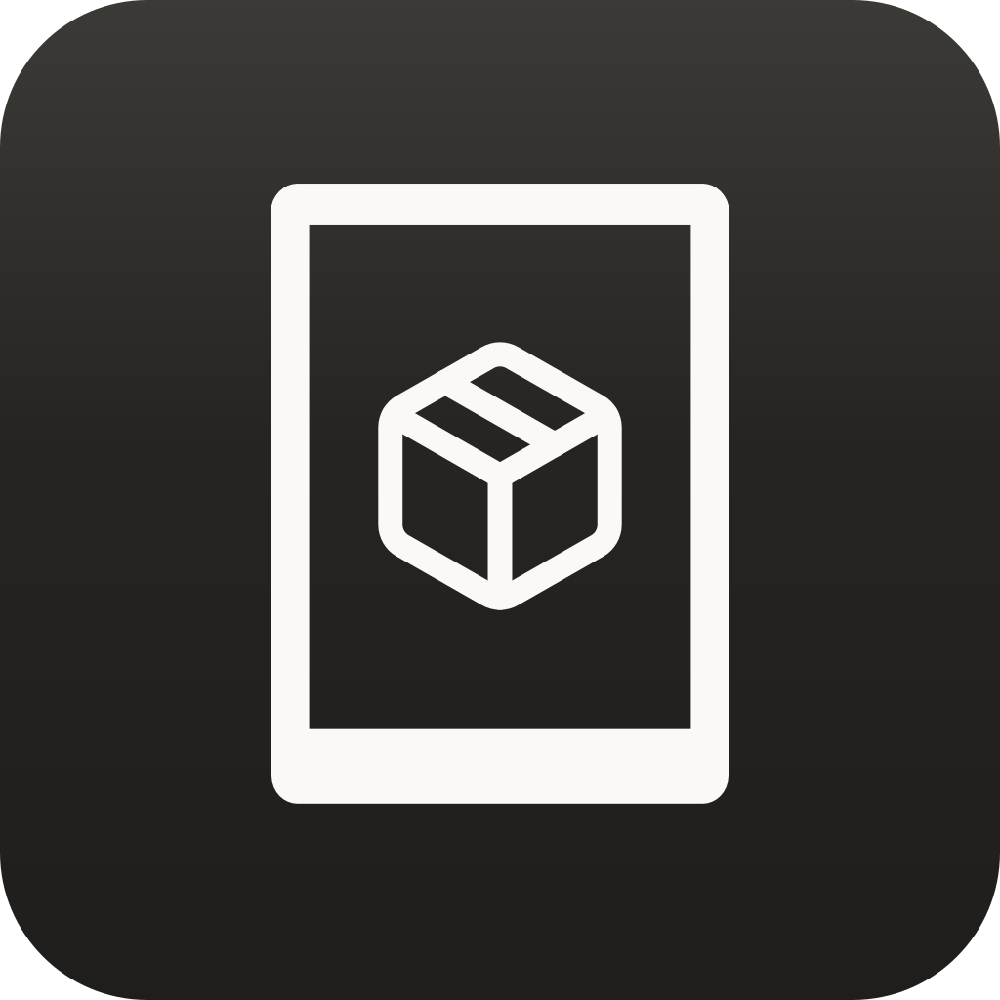
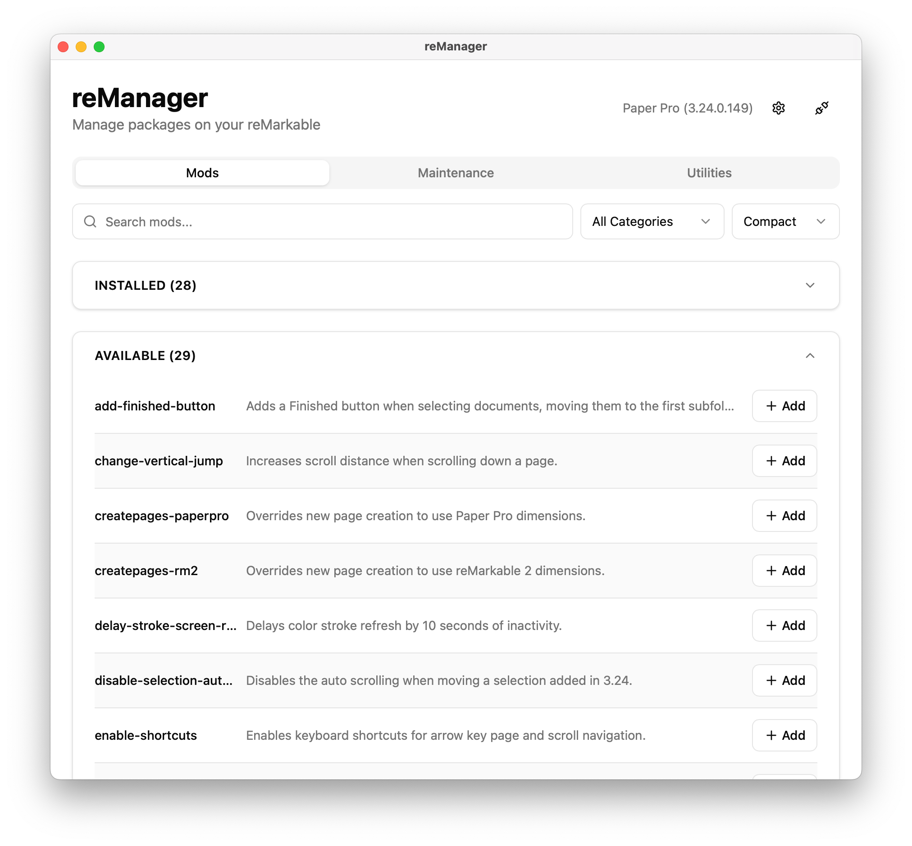
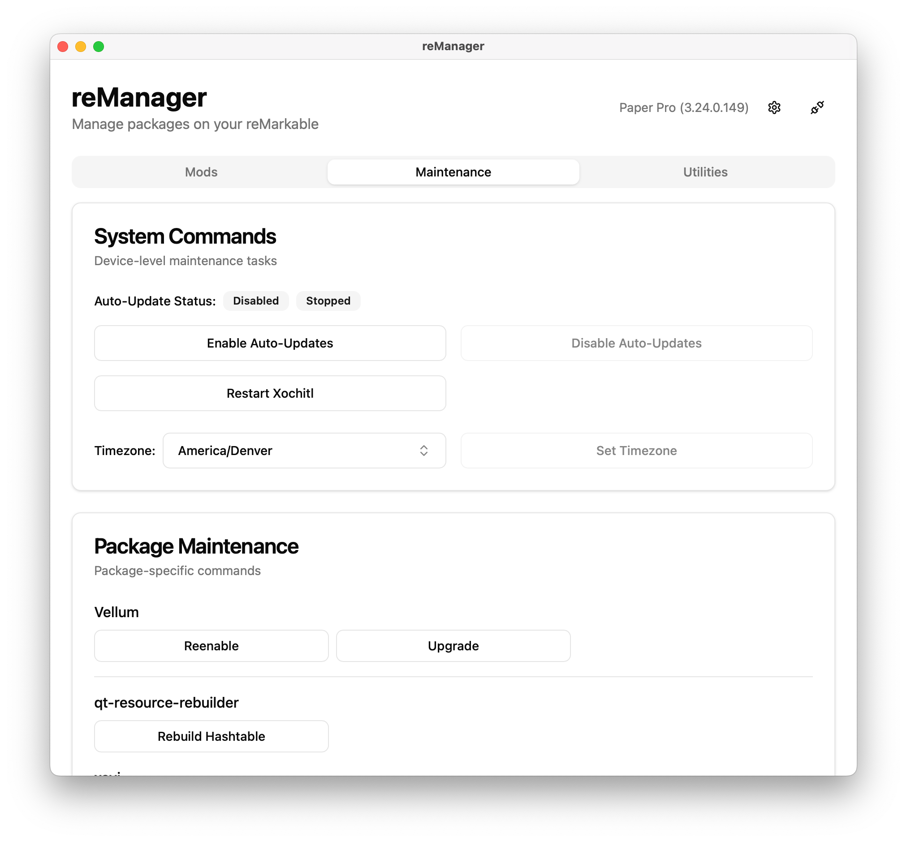
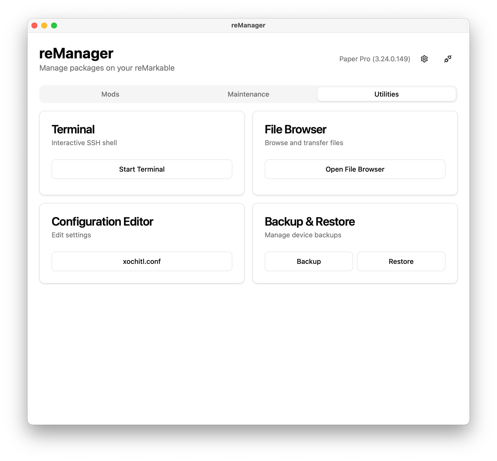

# reManager

<p align="justify">

[](https://remarkable.com/store/remarkable)
[](https://remarkable.com/store/remarkable-2)
[](https://remarkable.com/store/overview/remarkable-paper-pro)
[](https://remarkable.com/products/remarkable-paper/pro-move)

A multi-platform desktop app for managing mods on reMarkable tablets.

Powered by the [Vellum](https://github.com/vellum-dev) package manager. See the [package index](https://vellum.delivery) for a full list of supported packages.

## Features

- Multi-Device Management: Save multiple sets of SSH credentials with password or key-based authentication.
- Package Management: Browse, install, upgrade, and uninstall packages with automatic dependency resolution.
- Maintenance Tools
  - Enable / disable reMarkable auto-updates
  - Set system timezone
  - Run package-provided scripts or commands
- Utilities
  - Interactive terminal: Access a complete shell session on your reMarkable without leaving reManager.
  - File browser: Browse reMarkable's filesystem, transfer files to and from your reMarkable.
  - Backup & Restore: Backup and restore reMarkable document library and configuration.
  - Configuration editor: Edit system configuration files with a WYSIWYG editor with syntax highlighting.

## Installation

### Linux

Download and run the [latest release](https://github.com/rmitchellscott/reManager/releases/latest):
- Flatpak
- Binaries
   - Requires GTK 3 and WebGTK 4.1
 
Built for x86_64 (amd64) and aarch64 (arm64)

### macOS

Download and run the [latest release](https://github.com/rmitchellscott/reManager/releases/latest).  
Universal binary supports both Intel and Apple Silicon. 

### Windows

Download and run the [latest release](https://github.com/rmitchellscott/reManager/releases/latest).  
Built for x86_64 (amd64) and arm64.  
Bypassing SmartScreen is likely required.

## Screenshots

  <picture>
    <source
      srcset="assets/screenshot-mods-dark.png"
      media="(prefers-color-scheme: dark)"
    >
    
  </picture>

  <picture>
    <source
      srcset="assets/screenshot-maint-dark.png"
      media="(prefers-color-scheme: dark)"
    >
    
  </picture>

  <picture>
    <source
      srcset="assets/screenshot-utilities-dark.png"
      media="(prefers-color-scheme: dark)"
    >
    
  </picture>

## Tech Stack

Built with [Wails](https://wails.io/) (Go + React/TypeScript).

## Building

Requires Go 1.23+ and Node.js.

```bash
wails build
```
