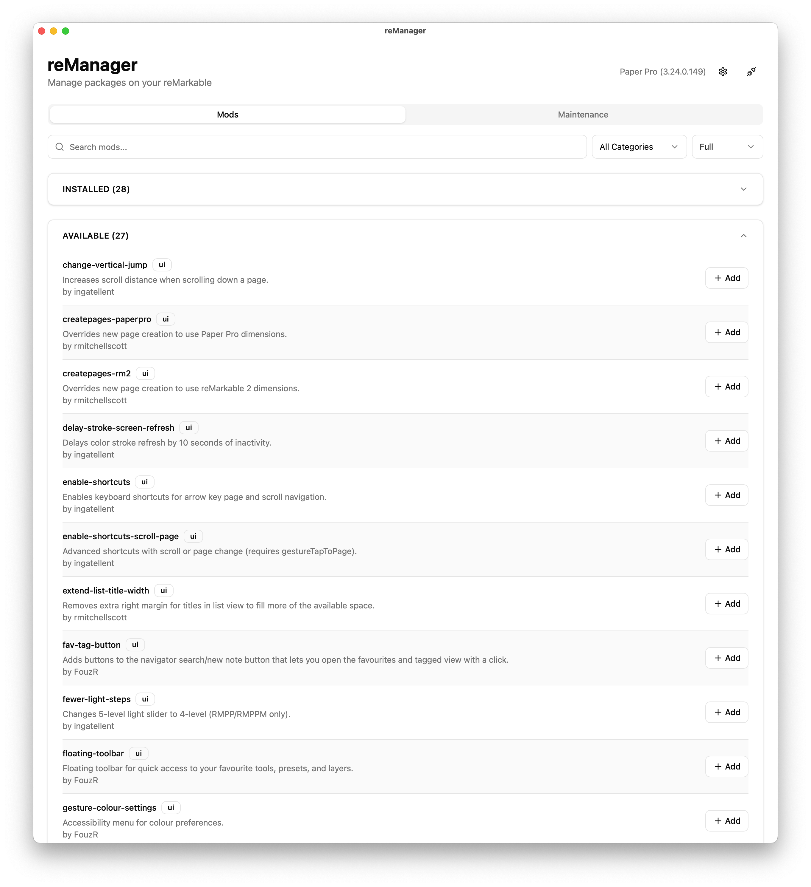

# reManager
[](https://remarkable.com/store/remarkable)
[](https://remarkable.com/store/remarkable-2)
[](https://remarkable.com/store/overview/remarkable-paper-pro)
[](https://remarkable.com/products/remarkable-paper/pro-move)

A multi-platform desktop app for managing mods on reMarkable tablets.

Powered by the [Vellum](https://github.com/vellum-dev) package manager. See the [package index](https://vellum.delivery) for a full list of supported packages.

> [!CAUTION]
> This is pre-release software. Features may change and bugs are expected.

## Features

- Multi-Device Management: Save multiple sets of SSH credentials with password or key-based authentication.
- Package Management: Browse, install, upgrade, and uninstall packages with automatic dependency resolution.
- Maintenance Tools: Run maintenance commands and system tasks with real-time terminal output.

## Screenshot

  <picture>
    <source
      srcset="assets/screenshot-dark.png"
      media="(prefers-color-scheme: dark)"
    >
    
  </picture>

## Tech Stack

Built with [Wails](https://wails.io/) (Go + React/TypeScript).

## Building

Requires Go 1.23+ and Node.js.

```bash
wails build
```
