## Navigating This Guide

To access the table of contents on your reMarkable:

1. Press the page overview button in the toolbar:

2. Press the table of contents button in the page overview:

\

To adjust font size or margins, open the **More Tools** menu (three dots) in the toolbar and select **Text Settings**. On the Paper Pro Move, go to **Adjust View** then **Text Settings**.

# Introduction

reManager is a desktop application for managing mods and packages on your reMarkable. It gives you a friendly graphical interface for browsing, installing, upgrading, and removing packages — no command line required.

\

reManager works with all reMarkable devices:

- reMarkable 1
- reMarkable 2
- reMarkable Paper Pro
- reMarkable Paper Pro Move

\

This guide will walk you through connecting to your reMarkable, managing packages, and using the built-in utilities.

## What is Vellum?

Behind the scenes, reManager uses a package manager called **Vellum** to handle mod installation. When you first connect, reManager will offer to set up Vellum on your reMarkable.

# Connecting to Your reMarkable

Before you can manage packages, you need to connect reManager to your reMarkable over SSH.

## Finding Your Connection Details

Your reMarkable reMarkable provides SSH connection details in its settings. On your reMarkable, navigate to **Settings → General → Help → Copyrights and licenses**. You'll find an IP address and password there.

The default IP address when connected via USB is **10.11.99.1**.

\

If you have a Paper Pro or Paper Pro Move, you'll need to enable developer mode first. The QR code below is a link to reMarkable's Developer Mode documentation. 

\

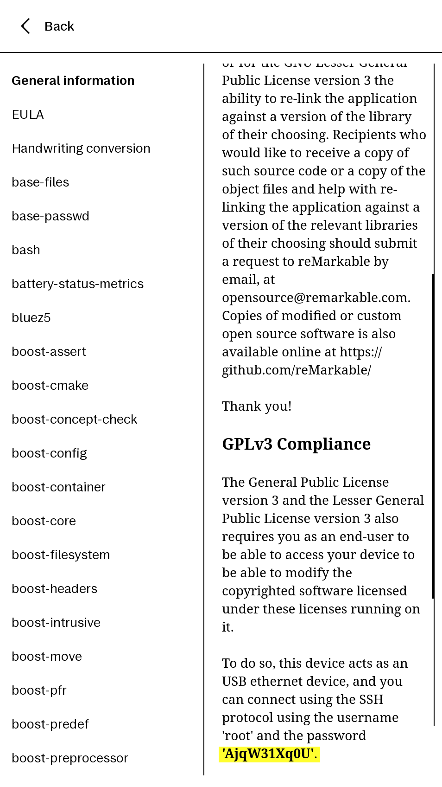

## Connecting for the First Time

When you open reManager, you'll see the Add reMarkable screen.

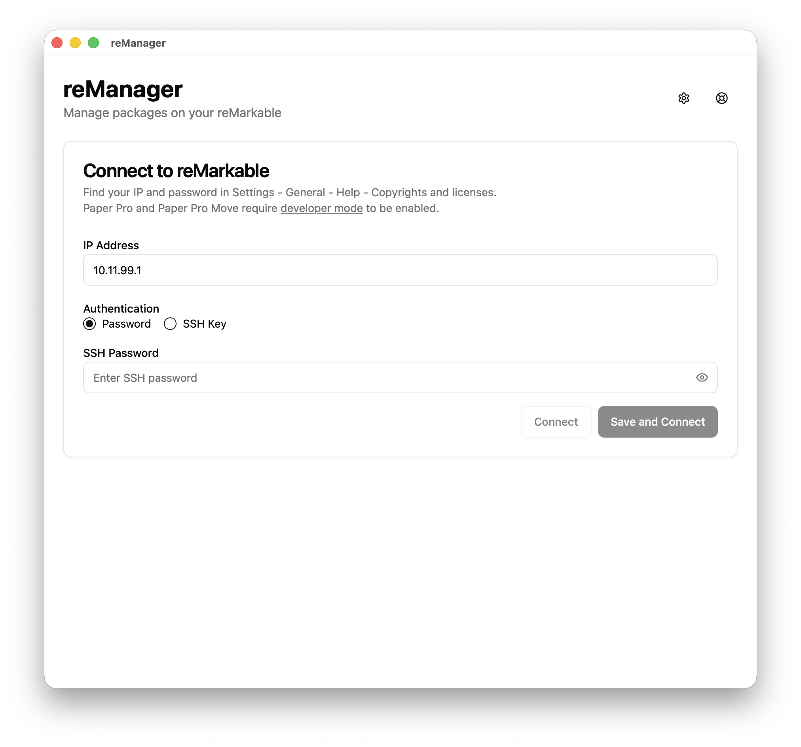

1. Enter the **IP address** from your reMarkable (the default is `10.11.99.1` for USB connections)
2. Select your authentication method:
   - **Password** — type in the password shown on your reMarkable
   - **SSH Key** — choose a key file from your computer
   - **SSH Agent** — use an already-running SSH agent (this option only appears if an agent is detected)
3. Click **Save and Connect** to save these credentials for next time, or **Connect** for a one-time connection

### Using Password Authentication

This is the simplest option. Enter the password from your reMarkable's settings screen. Click the eye icon to show or hide what you've typed.

### Using an SSH Key

If you've set up SSH key authentication on your reMarkable, select **SSH Key** and choose your key from the dropdown. reManager automatically finds keys in your `~/.ssh/` directory. If your key is stored elsewhere, select **Other...** to browse for it.

If your key is protected with a passphrase, enter it in the **Key Passphrase** field. If it's not encrypted, leave this field empty.

### Using an SSH Agent

If you use an SSH agent (common on Linux and macOS), select **SSH Agent**. reManager will use whatever keys your agent has loaded. You can configure the agent socket path in Settings if it's not auto-detected.

## Saving and Managing Devices

When you click **Save and Connect**, your device is saved so you don't have to enter credentials again. You can:

- **Edit** a saved device to update its name, address, or credentials
- **Remove** a saved device you no longer need
- **Sort** your devices by most recently used or alphabetically

You can save and connect to multiple reMarkable tablets.

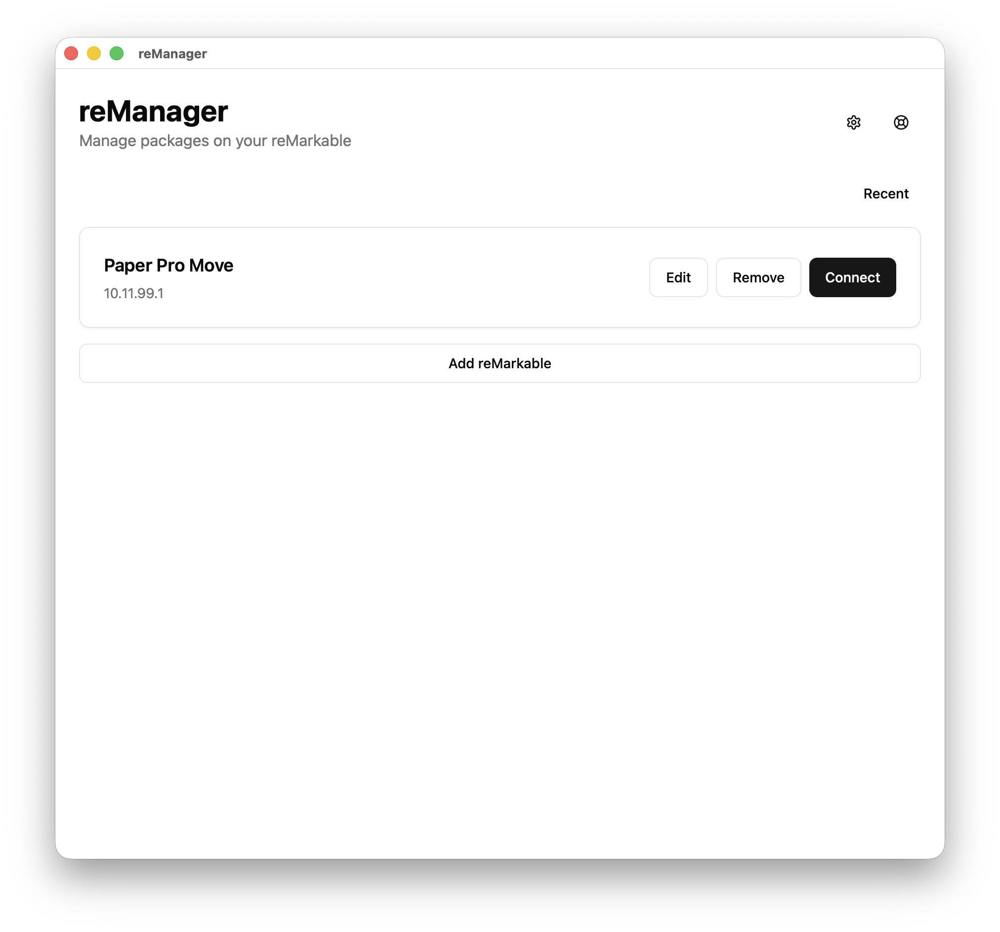

# Managing Mods

The **Mods** tab is where you can browse available packages and manage what's installed on your reMarkable.

## Browsing Packages

The Mods tab organizes packages into two collapsible sections:

- **Installed** — packages currently on your reMarkable
- **Available** — packages you can install

\

You can search for packages by name using the search bar, or filter by category or developer using the dropdown menus. Switch between **Full** and **Compact** view modes depending on how much detail you want to see at a glance.

Click the refresh button to reload the package list from the server.

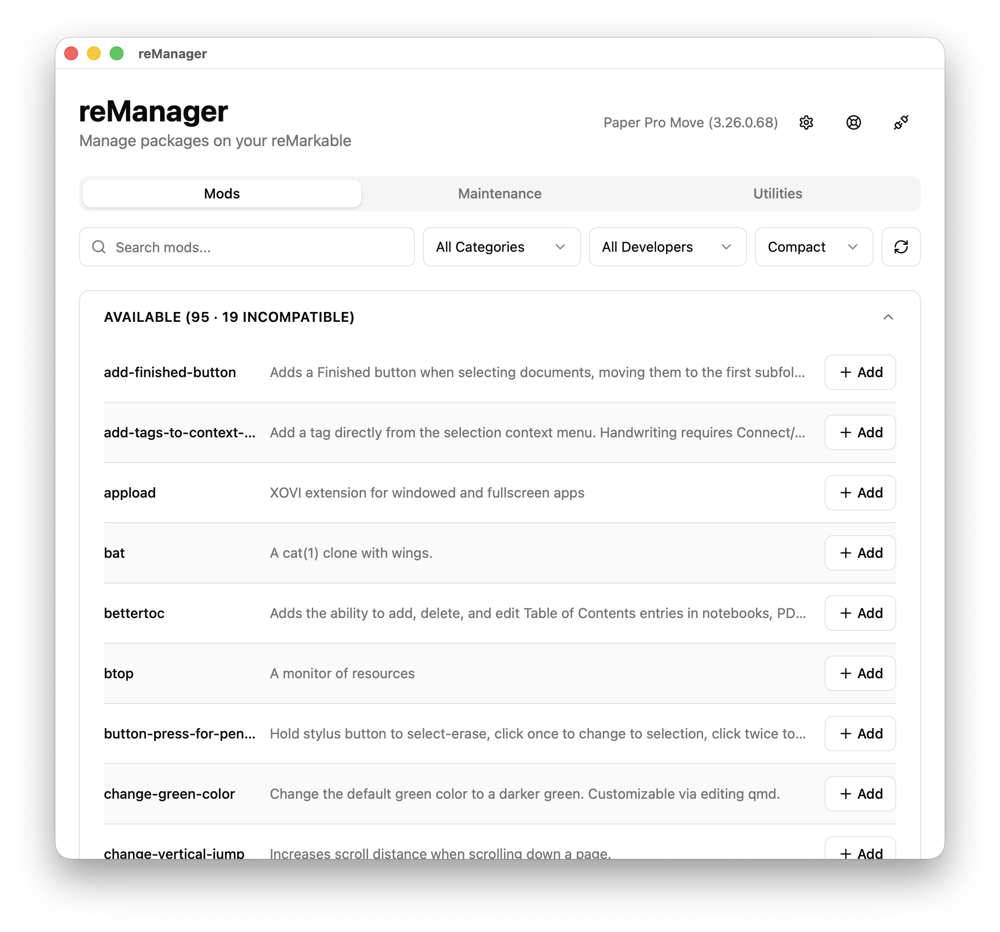

## Viewing Package Details

Click on any package to open its details panel. Here you'll find:

- **Description** — what the package does
- **Version** — the current version, with an upgrade indicator if an update is available
- **Author** — who created it, with a link to the project if available
- **Categories** — displayed as badges
- **License** — how the package is licensed
- **Devices** — which reMarkable models the package works with, shown as badges
- **OS Version** — which reMarkable OS versions are supported
- **Dependencies** — other packages this one requires, with their install status
- **Conflicts** — packages that can't be installed alongside this one
- **Project URL** — a link to the project page

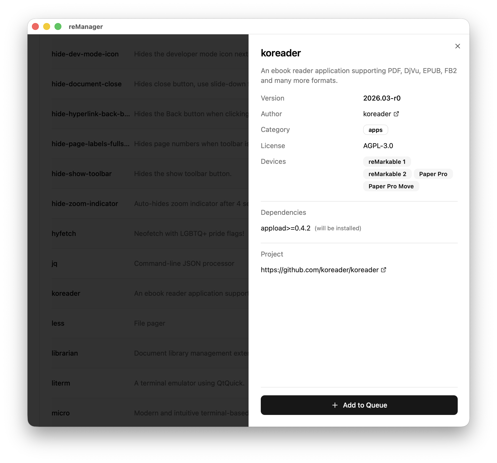

## Installing Packages

reManager uses a queue system for installing packages. Rather than installing one at a time, you build up a list and install them all at once.

\

1. Browse or search for the package you want
2. Click **Add** next to the package (or **Add to Queue** in the details panel)
3. The package appears in the install queue at the bottom of the screen
4. When you're ready, click **Install Selected** to install everything in the queue

\

You can remove individual items from the queue by clicking the X next to them, or click **Clear Install Queue** to start over.

If a package is not compatible with your reMarkable's OS or conflicts with an installed package, the add button will be disabled and you'll see a message explaining why if you hover over the Add button.

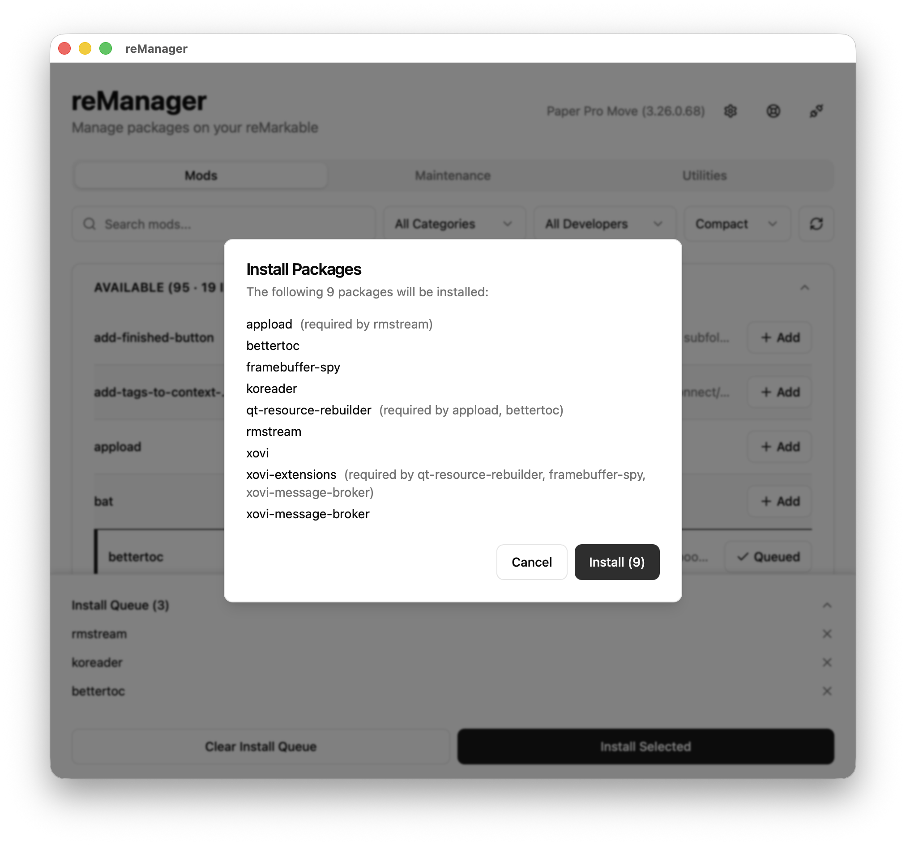

## Upgrading Packages

Use the Vellum **Upgrade** command in the Maintenance tab to check for and install package updates.

## Uninstalling Packages

Uninstalling also uses a queue:

1. Find the package in the **Installed** section
2. Click **Remove** next to the package
3. The package appears in the uninstall queue at the bottom of the screen
4. Click **Uninstall Selected** to remove everything in the queue

You can clear the uninstall queue the same way as the install queue.

## Warnings

When reManager detects issues that need attention, an amber **Action Required** banner appears below the toolbar. It may show one or more of the following:

- **Hashtable not built** — the hashtable required by UI mods hasn't been generated yet. Run **Rebuild Hashtable** from the Maintenance tab.
- **Hashtable version mismatch** — the hashtable was built for a different OS version than what's currently running. Rebuild it from the Maintenance tab.
- **Timezone mismatch** — the device timezone differs from your saved preference.
- **Auto-updates enabled** — automatic OS updates may interfere with mods. Disable them from the Maintenance tab.
- **Reenable needed** — packages that modify the system partition need to be reenabled.
- **Mods not running** — mods are installed but the mod framework isn't active. Run **Start UI with Mods** from the Maintenance tab.

Click **Go to Maintenance** in the banner to jump directly to the Maintenance tab.

## OS Change Detected

When reManager detects that your reMarkable's OS has been updated, an **OS Change Detected** card appears in the Mods tab showing the previous and new OS versions. It lists your installed packages and their compatibility with the new version. Click **Upgrade Packages** to complete the upgrade process.

# Maintenance

The **Maintenance** tab provides system-level tools and package-specific commands.

## System Tasks

A grid of system task buttons is available at the top of the tab:

- **Enable Auto-Updates** / **Disable Auto-Updates** — control automatic reMarkable OS updates. Disabling updates is highly recommended if you install mods. The toggle to disable auto-updates in the reMarkable UI has a known issue on the Paper Pro and Paper Pro Move that makes it revert to enabled after every restart. reManager works around this bug and it will stay disabled if disabled from reManager. 
- **Restart reMarkable UI** — restart the reMarkable's user interface without rebooting the device.

The tab also shows the current auto-update status (enabled or disabled, running or stopped).

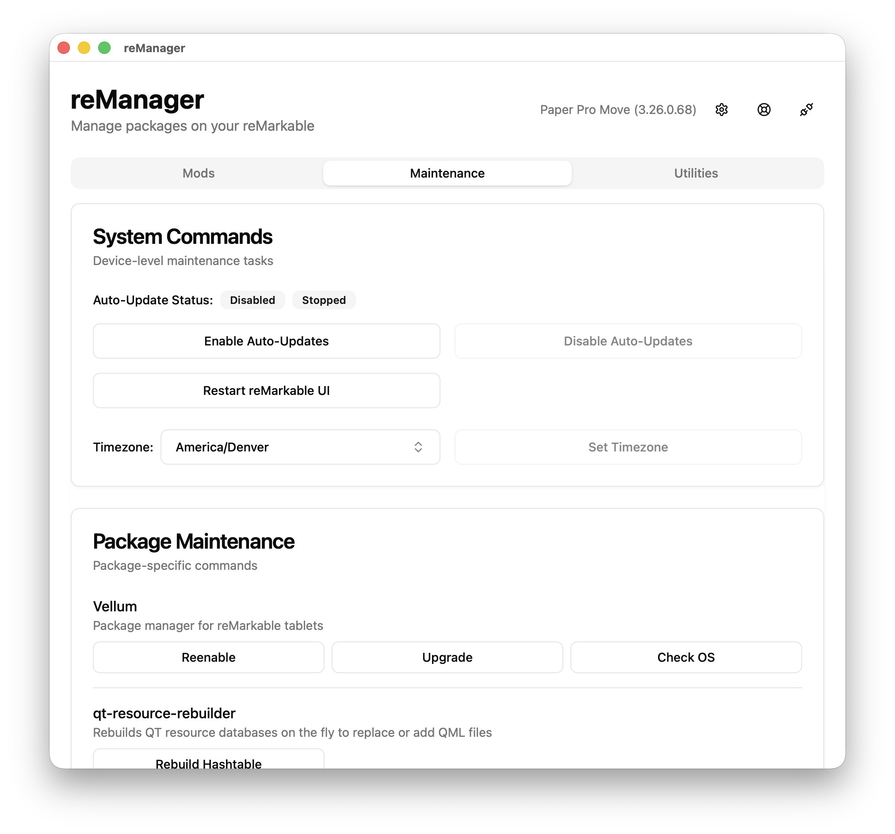

### Timezone

You can view and change your reMarkable's timezone using the timezone dropdown and the **Set Timezone** button. If the detected timezone doesn't match what's configured, the button will be highlighted.

## Package Commands

Some packages provide their own maintenance commands that appear here after installation. These commands are displayed in a grid with their descriptions shown as tooltips.

When you run a command, a progress view shows its output in real time. Some commands can be stopped mid-way if needed.

### Vellum Commands

When Vellum is installed, three commands are available:

- **Reenable** — reenable packages that modify the system partition (required after an OS update)
- **Upgrade** — check for and install package updates
- **Check OS** — check package compatibility with a target OS version

# Utilities

The **Utilities** tab provides a collection of tools displayed as a grid of cards. If you don't see this tab, enable it in Settings.

## Terminal

An interactive SSH shell session on your reMarkable, right inside reManager. When running, the terminal expands to fill the available space. This is useful for advanced users who want to run commands directly.

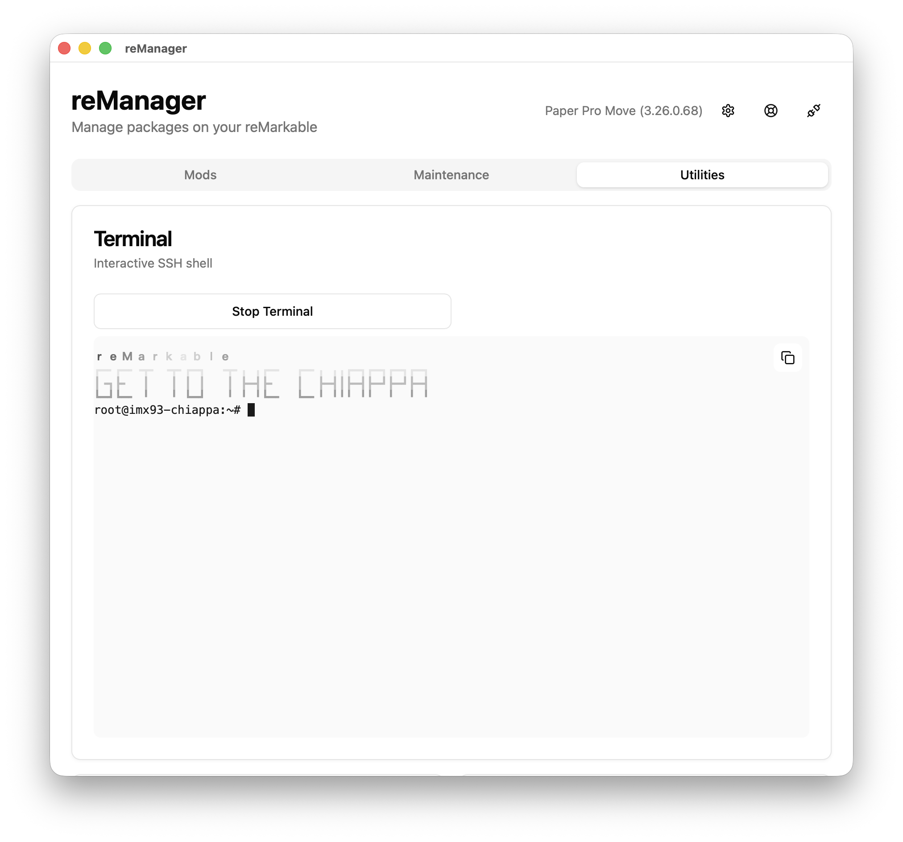

## File Browser

Browse and transfer files on your reMarkable's filesystem.

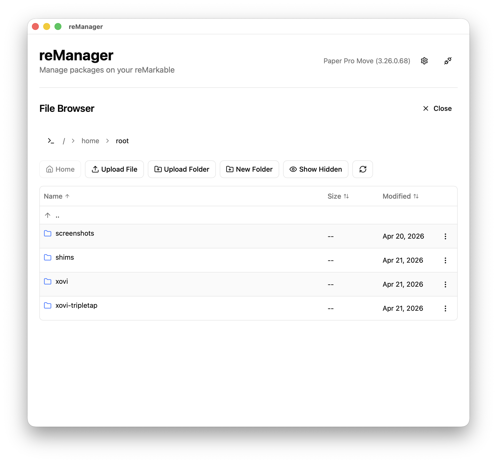

### Navigating

- Click folder names to open them
- Use the breadcrumb path at the top to navigate — each segment is clickable
- Click the terminal icon to edit the path as a text field
- Use the up arrow to go to the parent directory
- Click **Home** to go to `/home/root`
- Toggle **Show Hidden** / **Hide Hidden** to see files starting with a dot

### Sorting Files

Click the column headers to sort by name, size, or modification date. Click again to reverse the sort order.

### Uploading Files

Upload files to your reMarkable in two ways:

- Click **Upload File** or **Upload Folder** in the toolbar
- Drag and drop files from your computer into the file browser

A progress bar shows upload status, including file count and transfer speed.

### Downloading Files

Click the download action on any file or folder. Folders are downloaded recursively.

### Managing Files

Use the action buttons or right-click context menu to:

- **Rename** a file or folder
- **Delete** a file or folder (with confirmation)
- **New Folder** — create a new directory
- **Copy path** — copy the full path to your clipboard

### Sleep Screen

You can set any PNG image as your reMarkable's sleep screen using the file action menu. You can also reset to the default sleep screen. The reMarkable's UI will restart to apply the change.

### System File Warnings

When you modify files outside `/home/root`, reManager shows a confirmation dialog to make sure you intended to change system files. You can suppress these warnings in Settings if you're experienced with Linux systems.

## Configuration Editor

Edit your reMarkable's `xochitl.conf` settings file with syntax highlighting. This is for advanced users who need to modify configuration directly.

## Backup and Restore

Backups include documents and reMarkable configuration. Neither packages nor their settings are included.  

### Creating a Backup

1. Click **Backup**
2. Choose where to save the backup file on your computer
3. You'll see real-time progress including transfer details

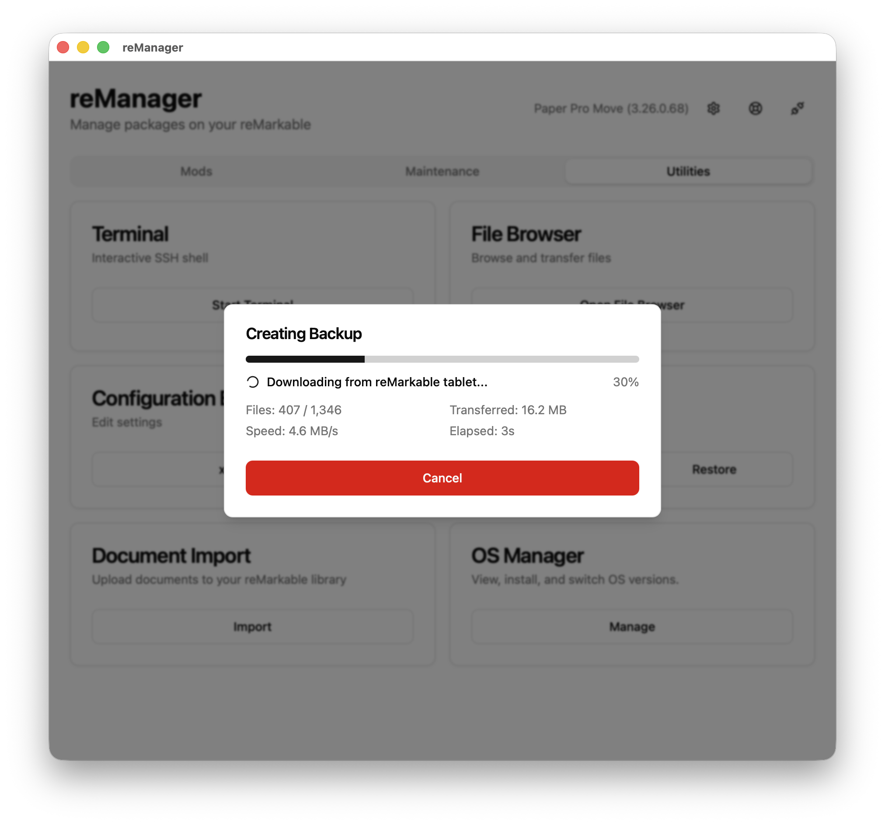

### Restoring a Backup

1. Click **Restore**
2. Select a backup file
3. Review the confirmation dialog — it shows which device the backup came from and which device you're restoring to
4. If the backup is from a different device model, you'll see a warning
5. The restore uploads the data and shows progress
6. Reboot your reMarkable when complete

## Document Import

Import documents directly to your reMarkable without using the reMarkable cloud.

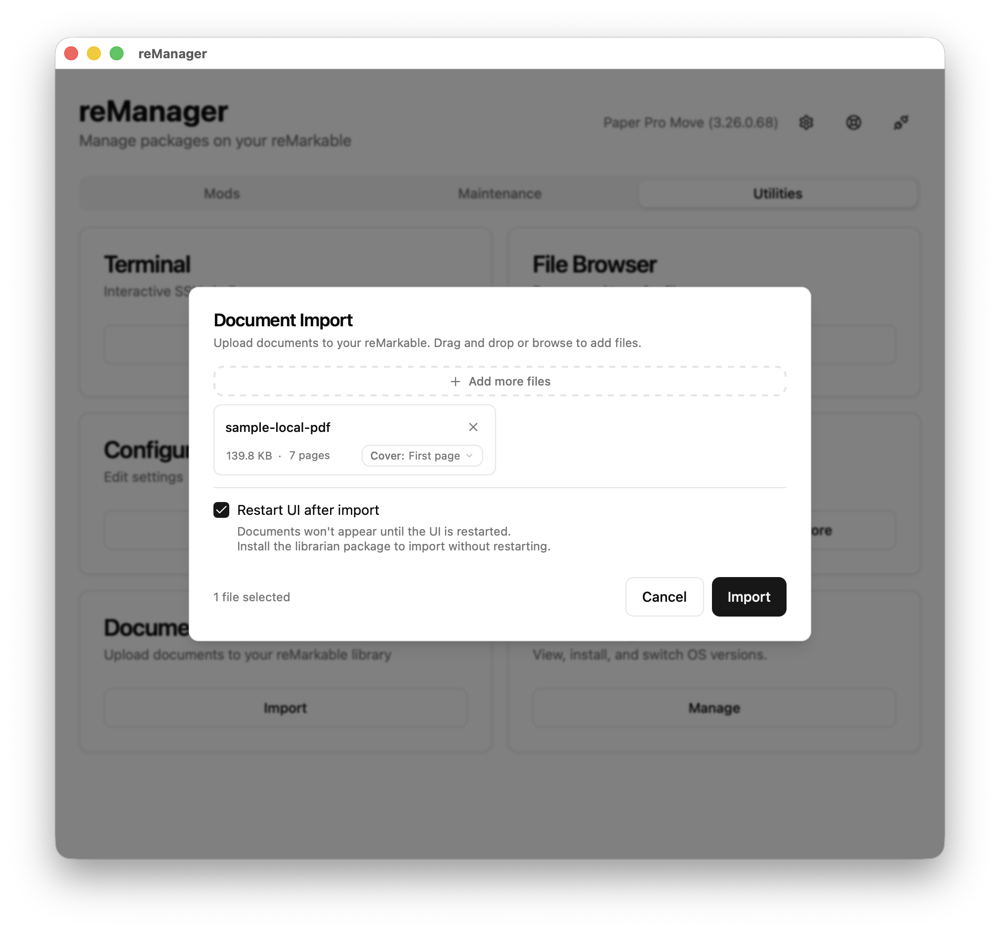

### Supported Formats

- **PDF** — with page count override and cover page options
- **ePub** — e-book files
- **rmdoc** — reMarkable notebook documents

### Importing Documents

1. Drag and drop files into the import area, or click to browse
2. Add as many files as you'd like — each appears as a card
3. For each file you can edit the display name
4. For PDFs, you can also:
   - Adjust the page count by clicking the number of pages
   - Choose the cover page: **First page** or **Last visited**
5. Check **Restart UI after import** if you want documents to appear immediately (the reMarkable's UI needs to restart to show new documents)
6. Click **Import** to transfer the files

Each file card shows its status: a spinner while uploading, a green border when done, or an error message if something went wrong.

## OS Manager

View and manage your reMarkable's operating system.

The OS Manager shows your reMarkable's two boot partitions (A and B) with their status:

- Which partition is currently running
- Which is set for next boot
- The OS version on each

You can switch which partition will boot next.

You can install a specific OS version by selecting it from the dropdown and clicking **Install**. Package compatibility is checked before installing and you will see a warning if any installed packages won't work with the target version.

After installation or switching partitions, use the **Reboot** button to switch to the new version.

# Settings

Access settings by clicking the gear icon.

## Appearance

- **Theme** — Light, Dark, or System (matches your computer's theme)
- **Terminal Theme** — Match reManager, Dark, or Light
- **Editor Theme** — Match reManager, Dark, or Light
- **Show Mods Tab** — toggle the Mods tab on or off
- **Show Utilities Tab** — toggle the Utilities tab on or off

## Behavior

- **Proxy Mode** — download packages through reManager before installing on the reMarkable. Useful if the reMarkable has limited internet connectivity. Defaults to on. 
- **Prevent Sleep** — keep the device awake while connected by simulating periodic input. Defaults to on. 
- **Check for Updates** — notify when a new version of reManager is available. Defaults to on.
- **Offer User Guide** — offer to install or update the user guide on the reMarkable when connecting. Defaults to on.
- **Suppress Filesystem Warnings** — skip confirmation dialogs when modifying system partition files. Only suppress if you are experienced with Linux systems. Defaults to off.

## SSH Agent Socket

- **Auto-detect** — uses the `SSH_AUTH_SOCK` environment variable
- **Custom socket path** — manually specify the path if auto-detection doesn't find your agent

## Data

- **Delete Command Logs** — clear stored command output logs. Logs are automatically cleaned up after 30 days.

## Uninstall Vellum

When connected and Vellum is installed, you can uninstall it from your reMarkable. A confirmation dialog gives you the option to also remove all installed packages at the same time.

# Tips and Troubleshooting

## Connection Issues

**I can't connect to my reMarkable!**

- Paper Pro and Paper Pro Move users: make sure developer mode is enabled
- Check that the IP address is correct — USB connections use `10.11.99.1`
- Make sure your reMarkable is turned on and connected to your computer via USB, or on the same Wi-Fi network if you've enabled ssh-over-wlan 
- Verify the password matches what's shown in your reMarkable's settings. Passwords are case-sensitive, double-check for characters that look the same (upper-case i & numeral one, etc)
- Try restarting your reMarkable if the connection was previously working

**The connection drops during operations!**

- Enable **Prevent Sleep** in Settings to stop the reMarkable from sleeping during long operations
- USB connections are more reliable than Wi-Fi

## Package Issues

**I don't see my mods!**

- AppLoad apps are accessible via the AppLoad button in the main navigator sidebar
- The mod framework needs to be started manually after every reboot
   - Install the tripletap package and triple-press the power button after booting
   - In the Maintenance tab, run the Start UI with Mods button
- The hashtable needs to be built for every OS version
   - Run Rebuild Hashtable in the Maintenance tab
- Mod is crashing
   - Run Debug in the Maintenance tab to capture the error
   - Upload a Support Bundle and submit an issue or use the community chat for support
- reMarkable OS updated
   - Disable auto-updates via the Maintenance tab
   - After an OS update, use the **Reenable** command in the Maintenance tab to reenable packages that modify the system partition

**When will x be added or updated?**

- Please do not ask for timelines or ETAs
   - reManager, Vellum, and the software packaged are maintained by unpaid members of the community with jobs and lives
   - OS updates typically require changes to UI mods along with testing, which cannot be started until the new OS version is fully released
- Feel free to open an issue in github.com/vellum-dev/vellum if there's a package that you'd like to see added or is out of date

**A package shows as incompatible?**

- Check the package's supported devices and OS version range in the details panel
   - **reMarkable OS beta releases are not supported**
- You may need to upgrade or downgrade your reMarkable's OS

**Packages conflict with each other?**

- Some packages can't coexist. The details panel shows which packages conflict.
- Uninstall the conflicting package before installing the new one.

# Getting Help

Click the Support (life buoy ring) icon in the top right of reManager's interface.

**Issues with reManager itself** should be reported via reManager's Report a Problem feature, or directly in the github repository: github.com/rmitchellscott/reManager

**For general questions or help** use the Community Chat button to open the Discord where many helpful and knowledgeable people (including mod developers) are active

**Package-related issues or package requests** should be submitted to the Vellum package repository: github.com/vellum-dev/vellum

**Issues with the software being packaged** should be submitted to the relevant upstream projects, which are linked in the reManager package details sidebar

## Support Bundles

Support bundles are diagnostic snapshots that help troubleshoot issues. You can generate them from the Support page.

1. If you have multiple saved devices, select which one to generate the bundle for
2. Review what's included and what's not
3. Choose **Save Locally** to save the bundle to your computer, or **Upload** to get a shareable URL

Uploaded bundles generate a unique URL you can share with support or the community. The URL is displayed and can be copied to your clipboard.

Previously uploaded bundles are listed with their upload date and expiration status. You can:

- **Copy** the bundle URL to your clipboard
- **Update** a bundle with fresh diagnostic data from the reMarkable
- **Delete** a bundle from the server

Uploaded data expires automatically after 30 days.
